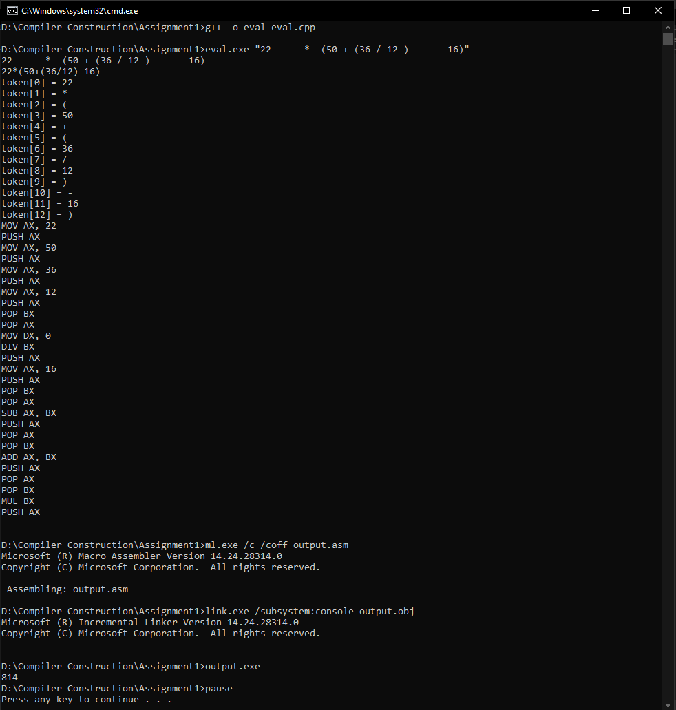

# Expression to Assembly Generator

A C++ program that generates the assembly code for a given expression.

### Prerequisites

- C++ compiler
- MASM (to run the assembly code that was generated)

### How to run

Copy the folder "Irvine" to your C:/ drive. Make sure you have **ml.exe** and **link.exe** in your PATH.

Open Command Prompt and navigate to this directory. Then type:

```
g++ -o eval eval.cpp
```

This will compile the C++ source file.

```
eval.exe "22     *  (50  + (36 / 12)    - 16 )"
```

This will run the **.exe** file with the expression as command line argument.

```
ml.exe /c /coff output.asm
```

This will assemble the **.asm** generated by the above **.exe**

```
link.exe /subsystem:console output.obj
```

This will link the **.obj** file generated by the above **.asm** file

```
output.exe
```

This will output the result of expression.

## Additional Notes

A Batch script **make_it_happen.bat** has been added which runs all the above commands for you in case you are lazy like me.

## Screenshot



## License

MIT
